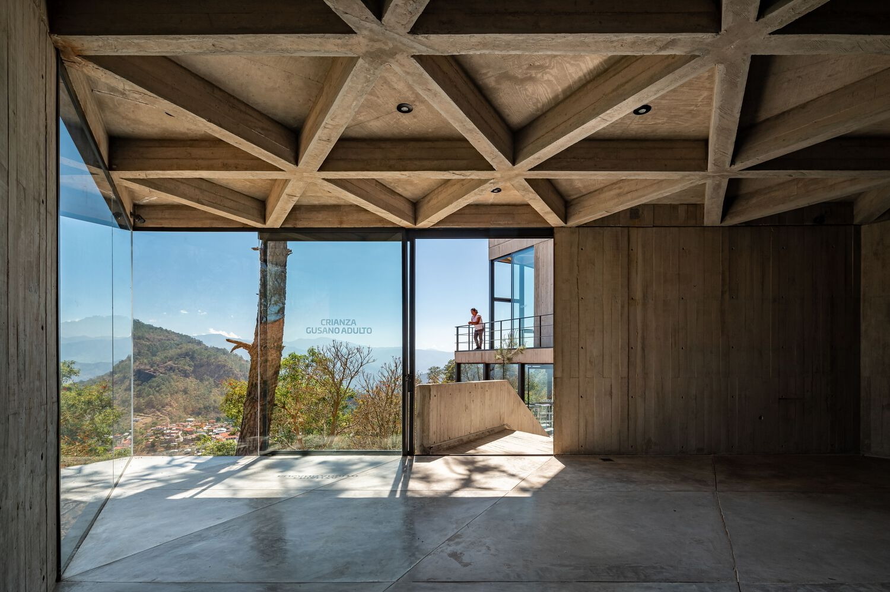

# Arquitectos Xxxx - Landing Page

A modern, responsive landing page for an architecture firm built with HTML, CSS, and JavaScript.

## Features

- Clean, modern design
- Responsive layout that works on all devices
- Image gallery with lightbox functionality
- Fade-in animations on scroll
- Location map integration
- Contact information section

## Technologies Used

- HTML5
- CSS3 (Flexbox, Grid, Animations)
- JavaScript (ES6+)
- Google Maps integration
- Font Awesome icons
- Google Fonts

## Live Preview

Visit the live site: [Arquitectos Xxxx Landing Page](https://yourusername.github.io/repository-name/)

## Screenshot

 